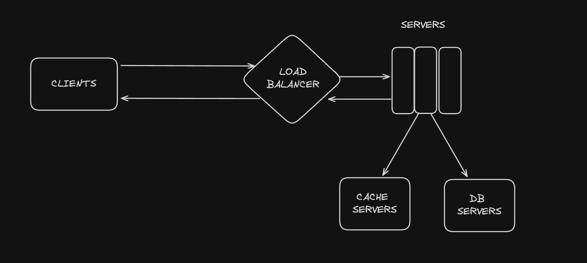

# url-shortener

## Intro
url-shortener is responsible for generationg short URLs and handling redirecting back to original URL when short url endpoint called.

You can see the API endpoints below:

```bash
Service: url-shortener 
Endpoints:
  POST - http://url-shortener-171881231.***.elb.amazonaws.com/shorten -d '{"url": "", "ttl": "ttl is optional")}' 
  GET - http://url-shortener-171881231.***.elb.amazonaws.com/health
  GET - http://url-shortener-171881231.***.elb.amazonaws.com/{short}
  ...
```

## Architecture



Redirection: (Read Path)
- Client sends a request to servers, example http://address.com/Q0w
- Server decodes Q0v value, which will be a logical ID
- checks cache server with ID, if found redirect user to its value(original URL)
- If not found, fallbacks to database and it finds the value there
- extends expire date in database with more 90 day
- writes the value the cache with 30 minute expire time
- then it redirects

Short URL Generation: (Write Path)
- Client send a post request to servers, example http://address.com/shorten -d ''
- Server checks the existence, if found, returns the old short URL info
- If not exist, it gets the last generated URL's ID, and increments it by one for auto incrementing
- encodes this auto-increment, not the URL value. It uses like a pointer
- (info) Encoding creates an unique and consistent output from predefined 62 chars, so it can be decoded back to original. (base62 conversion)
- (info) As the app is using this consistent hashing, it enables us to get more benefits from using caches.
- returns what is created in database


## Deployment Steps

This application requires 2 terraform deployments, one for terraform states and one for application itself.

Here are the steps:
# creating S3 Bucket and ECR repository
- cd ./infrastructure/1-terraform-base
- terraform init
- terraform plan
- terraform apply

If the Bucket and ECR created, follow with the next step.

# Pipeline configurations
- create a repository on github and commit
- update repository variables with these keys which are defined at .github/workflow/pipeline.yml at line 12.
- commit a tag to repository and this deploys the application and its infrastructure and shares the reachable URL with you
- test

## Performance

- Redirect path performance tests

```bash
        script: ./assets/load-test/redirect.js
        output: -

     scenarios: (100.00%) 1 scenario, 15 max VUs, 3m30s max duration (incl. graceful stop):
              * default: Up to 15 looping VUs for 3m0s over 3 stages (gracefulRampDown: 30s, gracefulStop: 30s)


     ✓ status was 200

     checks.........................: 100.00% ✓ 956       ✗ 0   
     data_received..................: 448 MB  2.5 MB/s
     data_sent......................: 2.2 MB  12 kB/s
     http_req_blocked...............: avg=530.59µs min=0s      med=1µs     max=101ms    p(90)=10µs     p(95)=13µs    
     http_req_connecting............: avg=277.56µs min=0s      med=0s      max=58.11ms  p(90)=0s       p(95)=0s      
   ✓ http_req_duration..............: avg=136.84ms min=14.16ms med=39.39ms max=704.05ms p(90)=415.35ms p(95)=464.84ms
       { expected_response:true }...: avg=136.84ms min=14.16ms med=39.39ms max=704.05ms p(90)=415.35ms p(95)=464.84ms
     http_req_failed................: 0.00%   ✓ 0         ✗ 6467
     http_req_receiving.............: avg=8.73ms   min=13µs    med=148µs   max=110.6ms  p(90)=52.71ms  p(95)=58.71ms 
     http_req_sending...............: avg=86.36µs  min=4µs     med=75µs    max=18.31ms  p(90)=139µs    p(95)=161µs   
     http_req_tls_handshaking.......: avg=233.06µs min=0s      med=0s      max=78.36ms  p(90)=0s       p(95)=0s      
     http_req_waiting...............: avg=128.01ms min=6.57ms  med=38.98ms max=703.86ms p(90)=414.7ms  p(95)=464.24ms
     http_reqs......................: 6467    35.576911/s
     iteration_duration.............: avg=1.93s    min=1.18s   med=1.97s   max=2.34s    p(90)=2.15s    p(95)=2.19s   
     iterations.....................: 956     5.259243/s
     vus............................: 1       min=1       max=15
     vus_max........................: 15      min=15      max=15


running (3m01.8s), 00/15 VUs, 956 complete and 0 interrupted iterations
default ✓ [======================================] 00/15 VUs  3m0s
```

- Shorten endpoint performance tests

