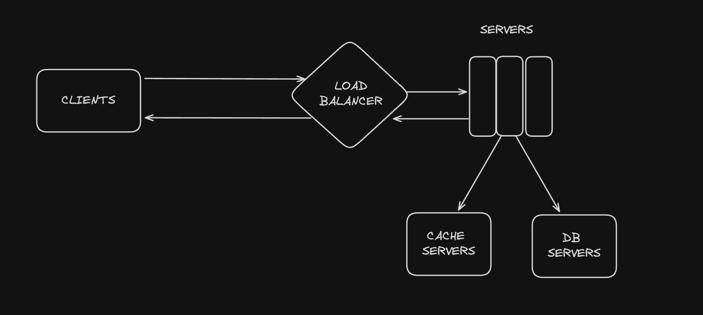
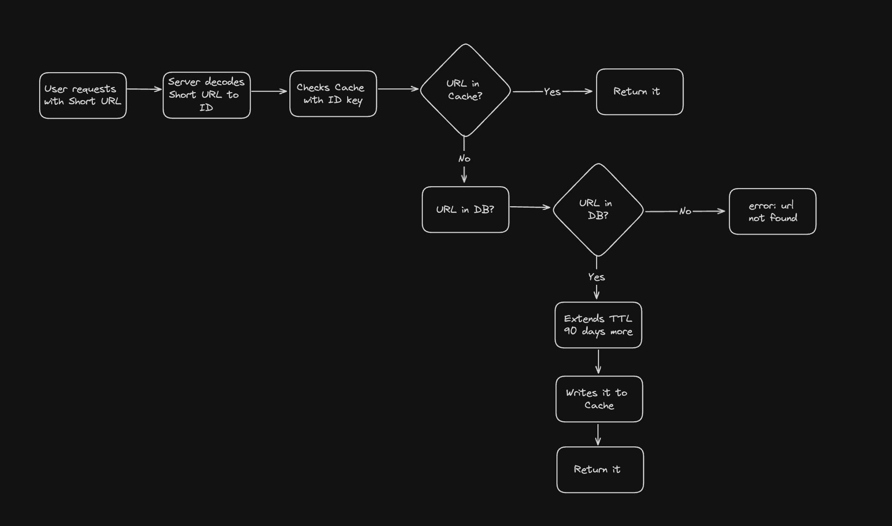
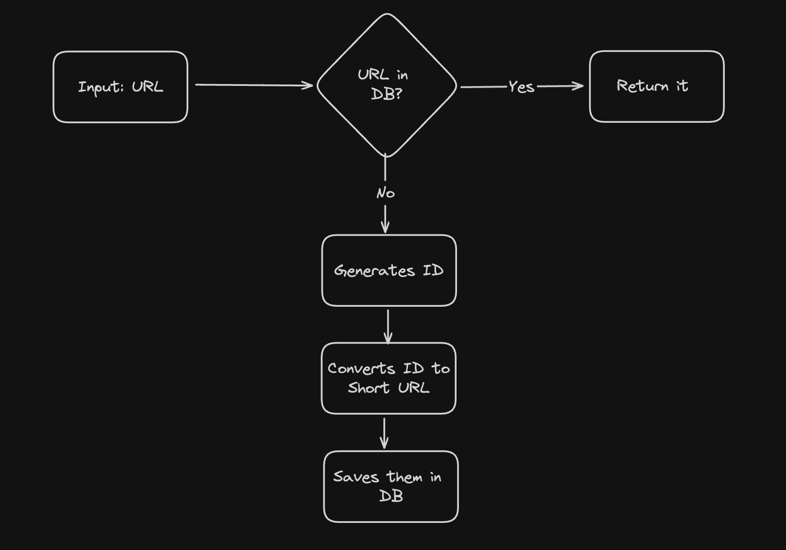

# url-shortener

## Intro
url-shortener is responsible for generating short URLs and handling redirection back to the original URL when the short url endpoint has been called.

You can see the API endpoints below:

```bash
Service: url-shortener 
Endpoints:
  POST - http://url-shortener-171881231.***.elb.amazonaws.com/shorten -d '{"url": "http://ahmetsoykan.com", "ttl": "1710899691"}' # ttl is optional 
  GET - http://url-shortener-171881231.***.elb.amazonaws.com/health
  GET - http://url-shortener-171881231.***.elb.amazonaws.com/{short}
  ...
```

## Architecture



Redirection: (Read Path)
- Client sends a request to servers, example http://address.com/Q0w
- Server decodes Q0v value, which refers to a logical ID
- checks cache server with ID, if found redirects user to its value(original URL)
- If not found, fallbacks to database and finds the value
- extends expire date in database with more 90 day because it has accessed within 90 day
- writes the value the cache with 30 minute expiration
- then redirects



Short URL Generation: (Write Path)
- Client send a post request to servers, example http://address.com/shorten -d ''
- Server checks the existence in database, if found returns the short URL info
- If not exist, it gets the last generated URL's ID, and increments it by 1 for auto incrementing
- encodes this auto-increment, not the whole URL value. It uses this like a pointer
- (info) Encoding creates unique and consistent output from predefined 62 chars, so it can be decoded back to original. (base62 conversion)
- (info) As the app is using consistent hashing in that manner, this enables us to get more benefits with caching caches.
- returns what is created in database




## Setup

This application requires 2 terraform deployments, one for terraform states and one for application itself.

- 1-terraform-base: deploys S3 Bucket and ECR
- 2-url-shortener: deploys application on ECS and creates EC2 Application Load Balancer with its Databases(DynamoDB, Elasticache)

Here are the steps:
### creating S3 Bucket and ECR repository
- cd ./infrastructure/1-terraform-base
- terraform init
- terraform plan
- terraform apply

If the Bucket and ECR created, follow with the next step.

### Pipeline configurations
- create a repository on github and commit
- update repository variables with expected keys which are also defined on .github/workflow/pipeline.yml at line 12.
- commit a tag to repository and this deploys the application and infrastructure and shares the reachable URL with you
- test

## Performance

- Redirect endpoint performance tests

```bash

Benchmarking url-shortener-171881231.eu-west-1.elb.amazonaws.com (be patient)
Server Software:        
Server Hostname:        url-shortener-171881231.eu-west-1.elb.amazonaws.com
Server Port:            80

Document Path:          /Q0w
Document Length:        53 bytes

Concurrency Level:      200
Time taken for tests:   2.878 seconds
Complete requests:      10000
Failed requests:        0
Non-2xx responses:      10000
Keep-Alive requests:    10000
Total transferred:      2380000 bytes
HTML transferred:       530000 bytes
Requests per second:    3474.89 [#/sec] (mean)
Time per request:       57.556 [ms] (mean)
Time per request:       0.288 [ms] (mean, across all concurrent requests)
Transfer rate:          807.64 [Kbytes/sec] received

Connection Times (ms)
              min  mean[+/-sd] median   max
Connect:        0   10 109.0      0    1654
Processing:    22   46  85.6     33     873
Waiting:       22   45  85.6     33     873
Total:         22   56 167.8     33    2104

Percentage of the requests served within a certain time (ms)
  50%     33
  66%     34
  75%     35
  80%     35
  90%     37
  95%     41
  98%    118
  99%    980
 100%   2104 (longest request)
```

- Shorten endpoint performance tests

```bash
Benchmarking url-shortener-171881231.eu-west-1.elb.amazonaws.com (be patient)

Server Software:        
Server Hostname:        url-shortener-171881231.eu-west-1.elb.amazonaws.com
Server Port:            80

Document Path:          /shorten
Document Length:        107 bytes

Concurrency Level:      50
Time taken for tests:   8.129 seconds
Complete requests:      10000
Failed requests:        0
Keep-Alive requests:    10000
Total transferred:      2490000 bytes
Total body sent:        2330000
HTML transferred:       1070000 bytes
Requests per second:    1230.09 [#/sec] (mean)
Time per request:       40.647 [ms] (mean)
Time per request:       0.813 [ms] (mean, across all concurrent requests)
Transfer rate:          299.11 [Kbytes/sec] received
                        279.89 kb/s sent
                        579.01 kb/s total

Connection Times (ms)
              min  mean[+/-sd] median   max
Connect:        0    0   6.4      0     161
Processing:    27   40  13.4     38     302
Waiting:       27   40  13.4     38     302
Total:         27   40  19.1     38     451

Percentage of the requests served within a certain time (ms)
  50%     38
  66%     39
  75%     40
  80%     41
  90%     44
  95%     48
  98%     54
  99%     76
 100%    451 (longest request)
```